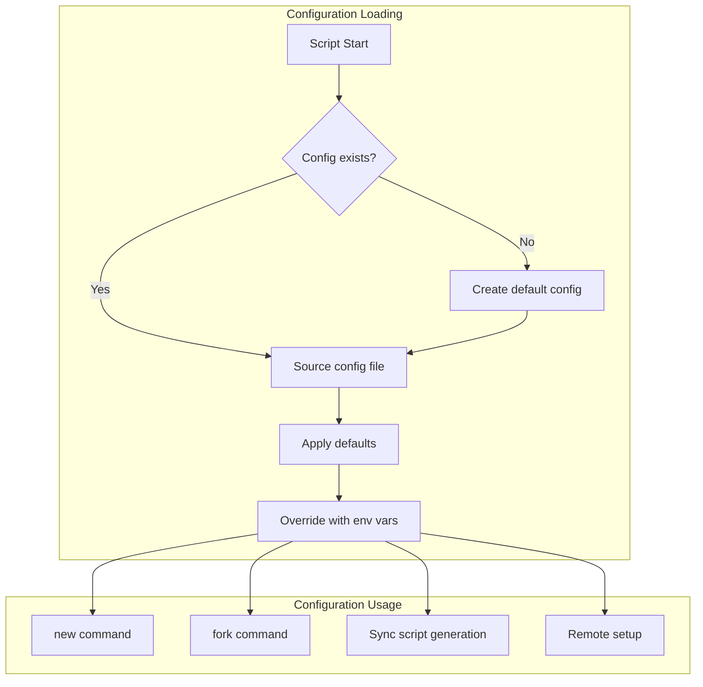
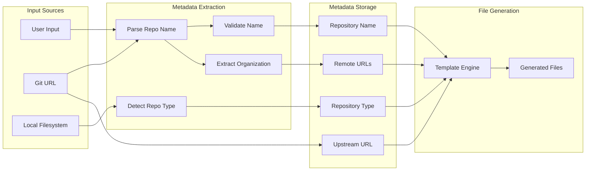
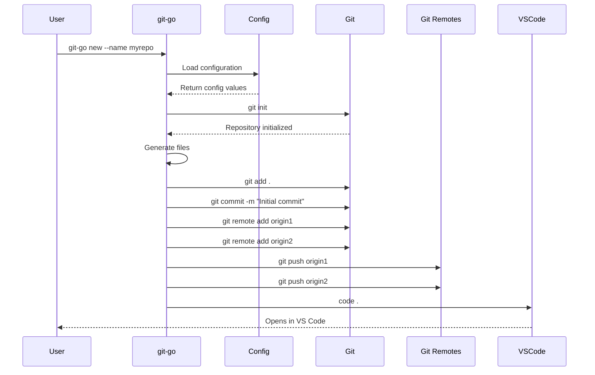
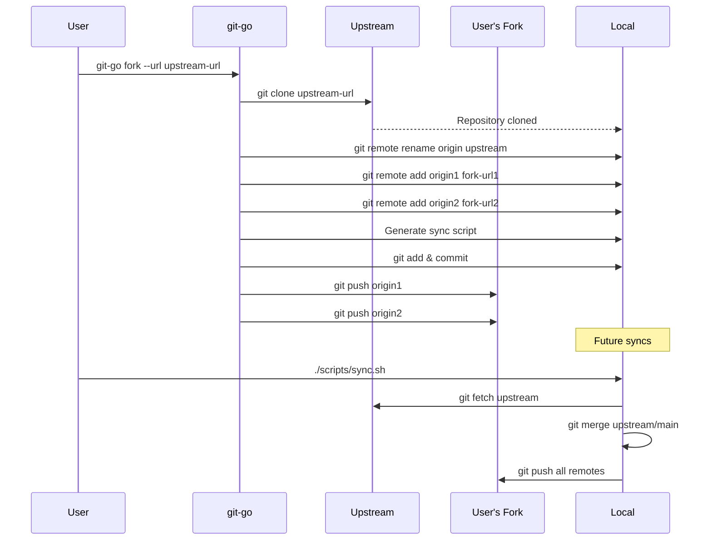
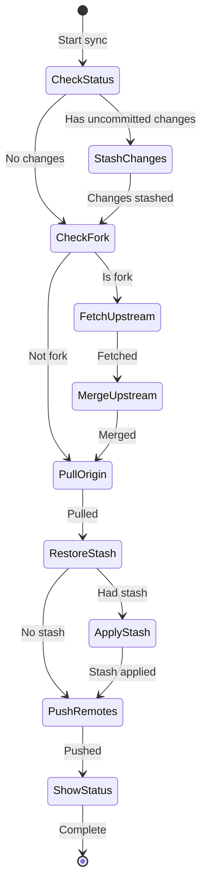
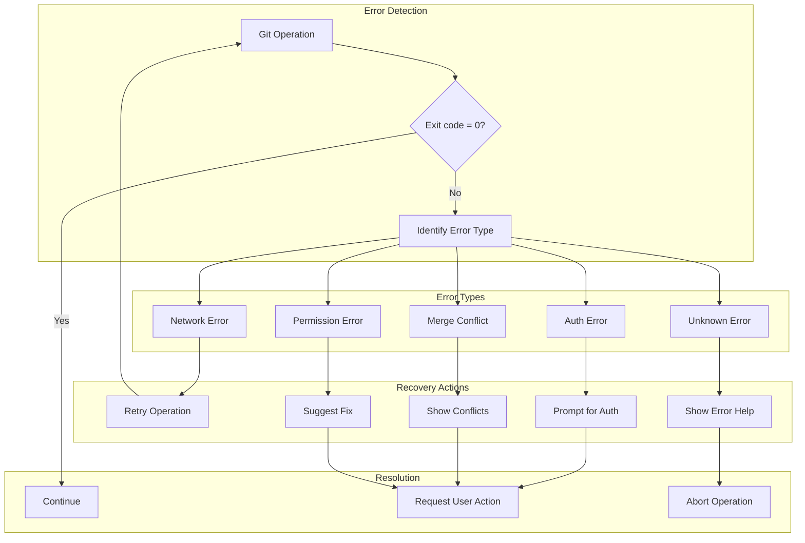
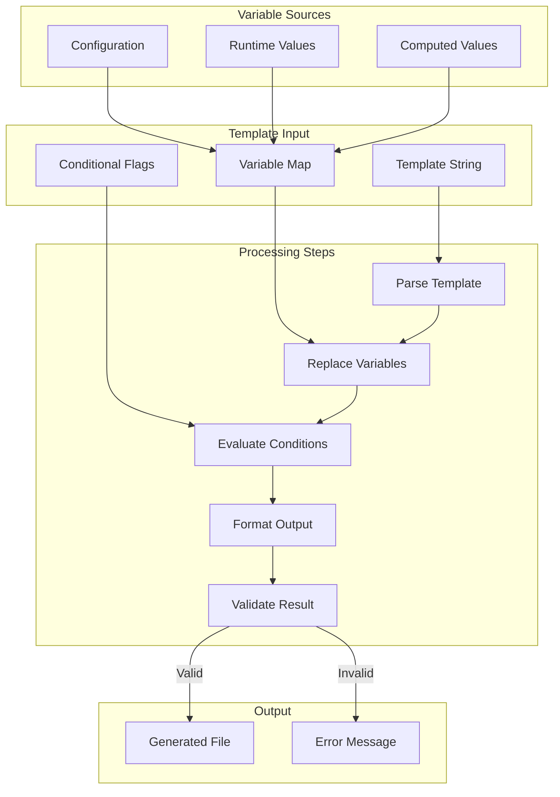
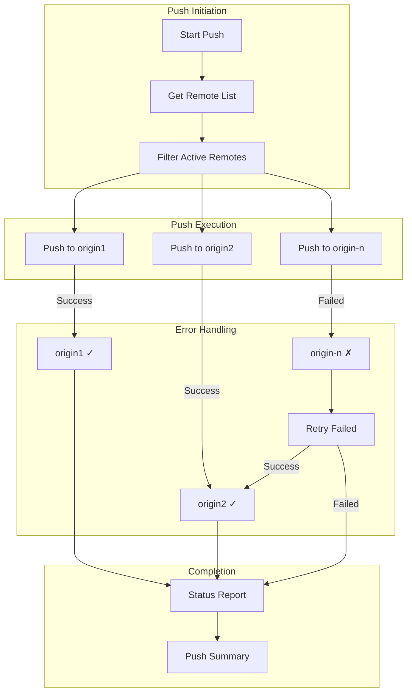

# Git-Go Data Flow Diagrams

## Configuration Data Flow

## Repository Metadata Flow

## Git Operations Sequence

## Fork Workflow Sequence

## Sync Script Execution Flow

## Error Recovery Flow

## Template Processing Pipeline

## Multi-Remote Push Strategy

