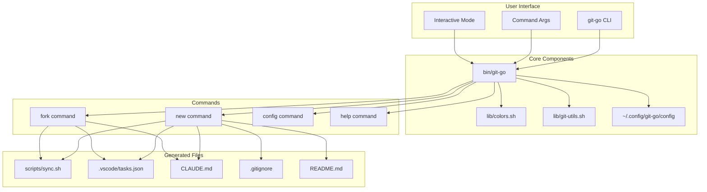
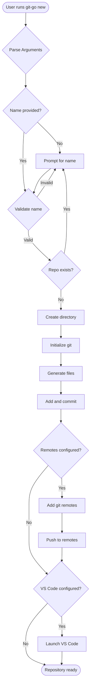
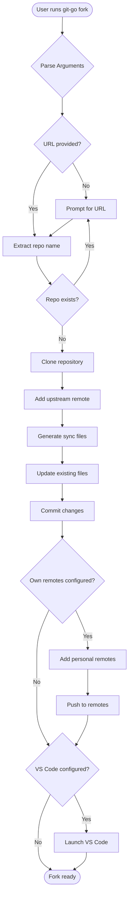
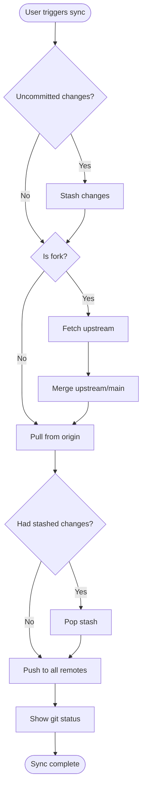
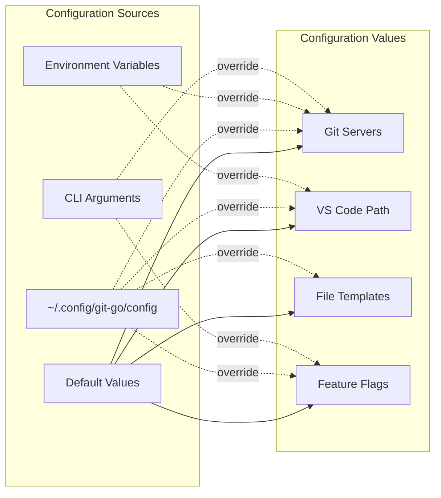
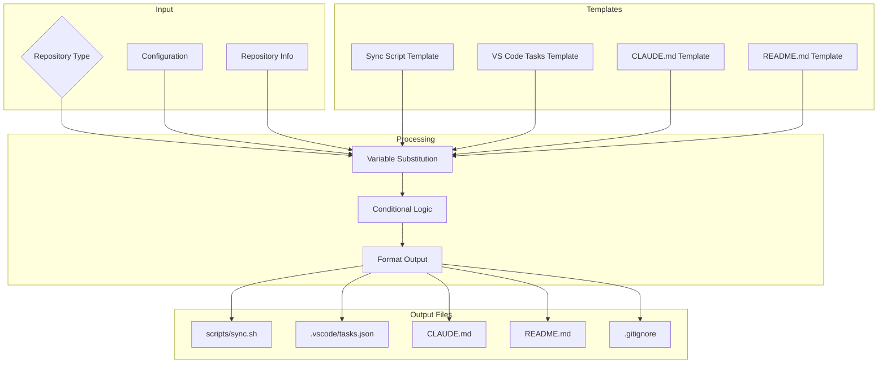
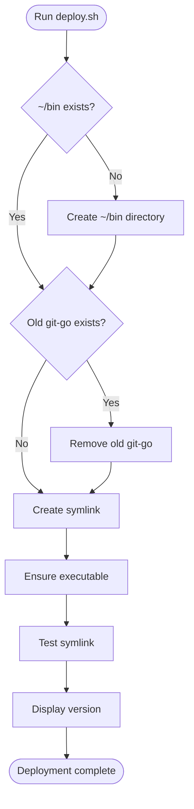
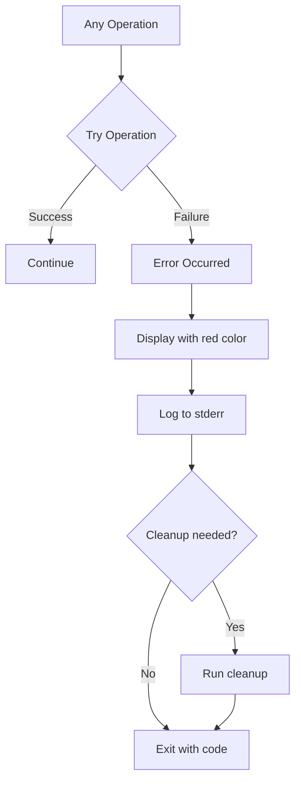

# Git-Go Architecture Diagrams

## System Architecture

## Command Flow: `git-go new`

## Command Flow: `git-go fork`

## Sync Script Operation

## Configuration System

## File Generation Process

## Deployment Process

## Error Handling Flow

